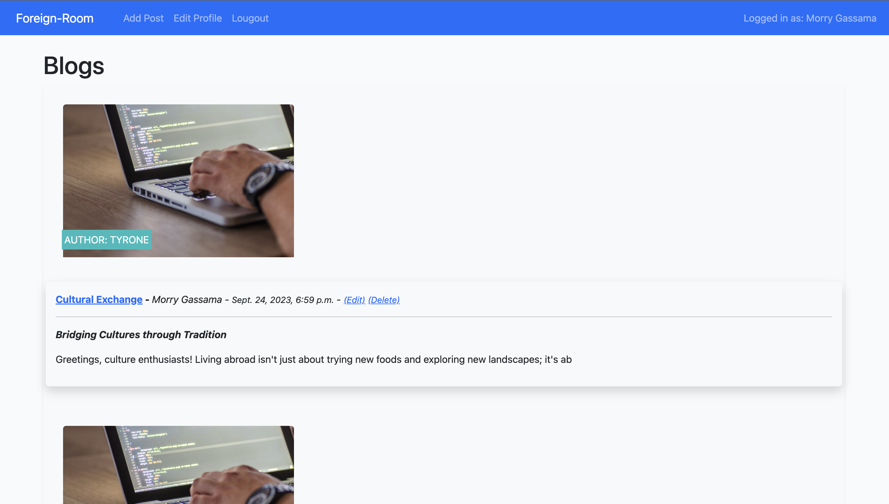
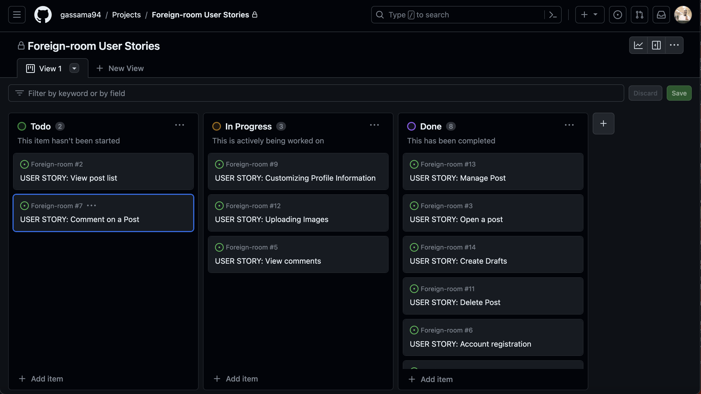
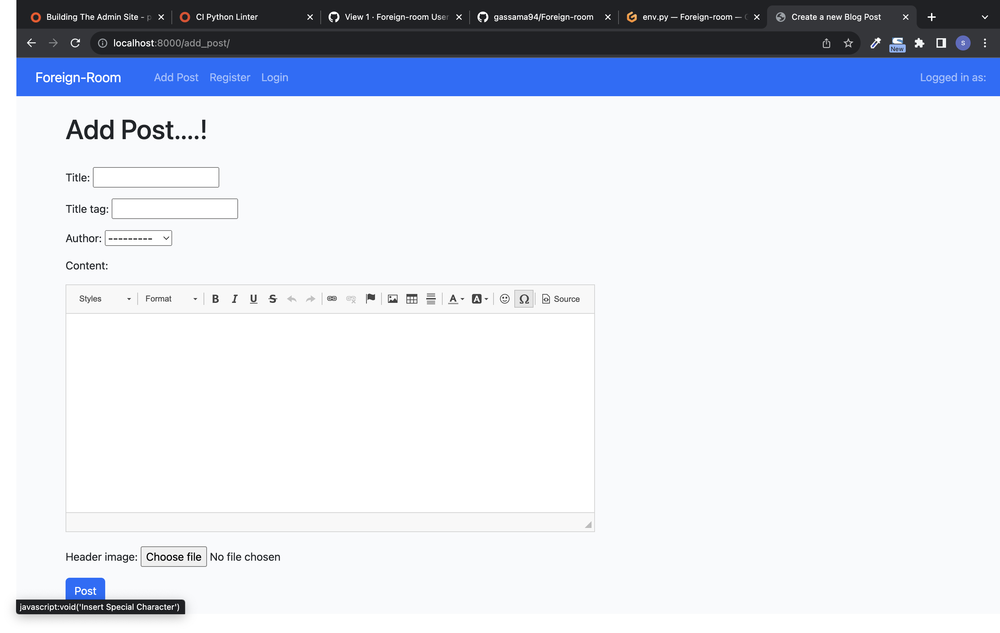
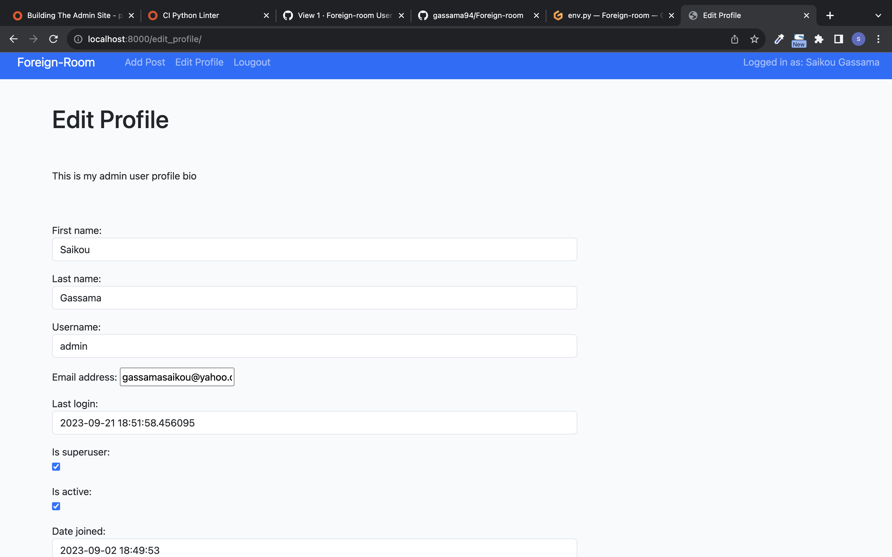
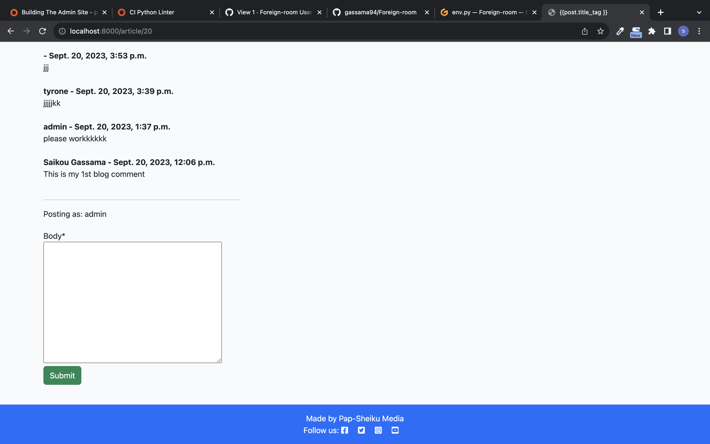
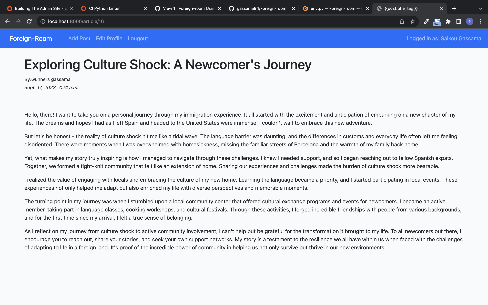

# Foreign-Room Blog

Welcome to the Foreign-Room Blog project! This README provides an overview of the project's structure and functionality. The blog is designed for information sharing among foreigners, where they can share their experiences in new countries, discuss events, and connect with like-minded people to exchange ideas and assistance. The project includes features such as user authentication, the ability to create, update, delete, and view blog posts, as well as liking posts and leaving comments. <a href="https://foreign-room-4472785d13b2.herokuapp.com/" target="_blank">Visit My Live Site</a>

## Table of Contents

1. [Project Overview](#project-overview)
2. [Agile Development](#agile-development)
3. [Models](#models)
4. [Forms](#forms)
5. [Viewing and Interacting with Posts](#viewing-and-interacting-with-posts)
6. [Folder Structure](#folder-structure)
7. [User Authentication](#user-authentication)
8. [Creating Blog Posts](#creating-blog-posts)
9. [Editing User Profile](#editing-user-profile)
10. [Liking Posts](#liking-posts)
11. [Leaving Comments](#leaving-comments)
12. [CRUD Operations](#crud-operations)
13. [Testing Blog Website](#testing-blog-website)
14. [Deployment](#deployment)
14. [Credits](#credits)
14. [Contributing](#contributing)

## 1. Project Overview

The Django Blog project is a web application that allows users to create, edit, and delete blog posts. Users can also interact with posts by liking them and leaving comments. Additionally, the project includes user authentication, allowing registered users to manage their profiles.

The Foreign-Room Blog project is a web application designed to facilitate information sharing among foreigners in new countries. Its primary purpose is to provide a platform for users to:

- Share Their Experiences: Users can write blog posts to share their experiences, challenges, and insights about living in a foreign country.

- Discuss Events: The blog allows users to discuss and promote events relevant to the foreign community, such as cultural events, meetups, and seminars.

- Connect with Like-Minded People: Users can connect with others who share similar experiences or interests, enabling them to exchange ideas and offer assistance.

## 2. Agile Development

This project followed Agile development principles to ensure flexibility, collaboration, and iterative progress. Here's how Agile practices were applied:

- **User-Centric Approach**: Agile development places a strong emphasis on understanding and addressing user needs. Throughout the project, user stories and feedback were collected to guide feature development and prioritize enhancements.

- **Iterative Development**: The project was broken down into small, manageable iterations. New features and improvements were continuously added in short development cycles. This allowed for quick feedback and adjustments based on user testing and changing requirements.

- **Cross-Functional Collaboration**: The project team consisted of cross-functional members, including developers, designers, and testers. Regular collaboration and communication ensured that different aspects of the project were addressed effectively.

- **Frequent Testing and Feedback**: Regular testing and feedback loops were established to catch issues early. Automated tests were used to maintain code quality, and user testing helped identify usability and functionality concerns.

- **Prioritization and Flexibility**: Agile methodologies encourage adapting to changing requirements. Features and tasks were prioritized based on their importance and value to users, allowing the team to adjust course as needed.

- **Continuous Deployment**: Continuous integration and continuous deployment (CI/CD) pipelines were set up to streamline the release of new features and updates.

## 3. Models

The Django Blog project uses several models to organize and store data. Here are the key models used in the project:

### User Profile Model

The `UserProfile` model extends the built-in `User` model provided by Django's authentication system. It includes the following fields:

- `user`: A one-to-one relationship with the User model.
- `bio`: A text field where users can provide a brief biography or description.
- `profile_img`: An image field for users to upload a profile picture.

### Blog Post Model

The `Post` model represents individual blog posts. It contains the following fields:

- `title`: A character field for the title of the post (limited to 255 characters).
- `title_tag`: A character field for the post's title tag (limited to 255 characters).
- `slug`: A slug field used for generating unique URLs for posts.
- `author`: A foreign key to the User model, establishing a relationship between users and their authored posts.
- `content`: A RichTextField for the post's content, which allows rich text formatting.
- `updated_on`: A datetime field that automatically updates whenever the post is modified.
- `header_image`: An image field for the post's header image.
- `created_on`: A datetime field indicating the post's creation date.
- `status`: An integer field representing the post's status, with options for "Draft" and "Published."
- `likes`: A many-to-many relationship with the User model to track users who have liked the post.

### Comment Model

The `Comment` model represents comments made on blog posts. It includes the following fields:

- `name`: A character field for the commenter's name.
- `post`: A foreign key to the Post model, establishing a relationship between comments and the posts they belong to.
- `email`: An email field for the commenter's email address.
- `body`: A text field for the comment content.
- `created_on`: A datetime field indicating the comment's creation date.
- `approved`: A boolean field to track whether the comment has been approved for display.

These models provide the structure for storing user profiles, blog posts, and comments in the Django Blog project.

## 4. Forms

The Django Blog project uses several forms for various functionalities. Here are some of the key forms used in the project:

### CommentForm

The `CommentForm` is used for creating and submitting comments on blog posts. It includes a single field, `body`, where users can enter their comment text. The form is customized using the `django-crispy-forms` package for improved rendering.

### PostForm

The `PostForm` is used for creating and updating blog posts. It includes fields such as `title`, `title_tag`, `author`, `content`, and `header_image` to allow users to provide information about their posts. This form is used for both creating new posts and editing existing ones.

### EditProfileForm

The `EditProfileForm` extends the built-in `UserChangeForm` provided by Django-allauth for user profile editing. It includes fields such as `first_name`, `last_name`, `username`, `email`, `last_login`, `is_superuser`, `is_active`, and `date_joined`. This form allows registered users to edit their profiles.

### CustomSignupForm

The `CustomSignupForm` extends the built-in `SignupForm` provided by Django-allauth for user registration. It includes fields such as `email`, `first_name`, `last_name`, `username`, `password1`, and `password2`. This form customizes the registration process.

## 5. Viewing and Interacting with Posts

In the Foreign-Room Blog project, Django's Class-Based Views (CBVs) are extensively utilized to handle various aspects of the application's functionality. CBVs provide a powerful and structured way to organize views, making code more modular and readable. Here's how CBVs are employed in the project:

### ListView

The `ListView` CBV is used to display a list of objects, primarily for viewing multiple blog posts and comments. Here are some instances where `ListView` is employed:

- **Blog Post List**: The list of all published blog posts is displayed on the home page. Users can browse and read posts.

- **Comment List**: Comments associated with a specific blog post are displayed below that post's detail view. Users can read and interact with comments.

### DetailView

The `DetailView` CBV is used to display detailed information about a single object. Key usages include:

- **Blog Post Detail**: When a user clicks on a blog post's title, the `DetailView` is used to display the full content of that post, along with comments and other relevant information.

### CreateView and UpdateView

The `CreateView` and `UpdateView` CBVs are employed for creating and updating objects, respectively. In the Foreign-Room Blog project, they are used as follows:

- **Create Blog Post**: The `CreateView` is used when a registered user wants to create a new blog post. It provides a form for users to input the post's details.

- **Update Blog Post**: Authors of blog posts can edit their content using the `UpdateView`. When they wish to modify a post, this view is employed to present a pre-filled form for editing.

### DeleteView

The `DeleteView` CBV is used for deleting objects. In the project, it serves the following purpose:

- **Delete Blog Post**: Authors can delete their own blog posts if they no longer wish to keep them. The `DeleteView` confirms the deletion action.

### FormView

The `FormView` CBV is used when rendering and processing forms that are not directly tied to model objects. Key examples include:

- **User Profile Editing**: The `FormView` is used to edit user profiles, including fields such as first name, last name, and email. While these fields are associated with the `User` model, the form is customized to provide a better user experience.

### TemplateView

The `TemplateView` CBV is employed for rendering static template files or simple views. In the Foreign-Room Blog project, it's used for:

- **Home Page**: The home page of the blog is rendered using a `TemplateView`. While this page includes a list of blog posts, the view itself is relatively straightforward, as most of the content is dynamic.

### Class-Based View Benefits

Class-Based Views offer several advantages in the development process:

- **Modularity**: Views are organized into separate classes, making it easier to locate and manage code related to specific actions.

- **Reusability**: CBVs can be reused for similar actions with minimal code duplication. For example, the same `CreateView` can be used for creating different types of objects.

- **Inheritance**: Developers can create custom views by inheriting from Django's CBVs, reducing the need to write repetitive code.

- **Mixins**: CBVs can be combined using mixins to add or override functionality. This allows for fine-grained control over views.

- **Readability**: The structured nature of CBVs enhances code readability and maintainability, making it easier for multiple developers to collaborate on a project.

- **Class-Based Authentication**: Authentication-related views, such as login and registration, can be handled using built-in CBVs from the `django-allauth` package.

Overall, Class-Based Views in Django streamline the development process, promote code organization, and contribute to a more maintainable codebase in the Foreign-Room Blog project.

## 6. Folder Structure

The project has the following folder structure:

- `blog/`: The main Django app containing models, views, and templates.
- `templates/`: HTML templates for rendering pages.
- `static/`: Static files such as CSS.
- `media/`: User-uploaded media files (e.g., images).
- `accounts/registration`: User authentication and profile management.
- `templates//`: Templates for user authentication views.
- `requirements.txt`: List of project dependencies.
- `manage.py`: Django management script.

## 7. User Authentication with django-allauth

User authentication is implemented using Django-allauth authentication system. Users can register, log in, log out, and manage their profiles. The project includes:

- Registration: Users can sign up for an account with a username and password.
- Login: Registered users can log in using their credentials.
- Logout: Users can log out to end their session.
- Profile Management: Registered users can edit their profiles, including changing their username and password.

## 8. Creating Blog Posts

Registered users can create new blog posts through the "Add Post" feature. They can provide a title, a title tag, and the content of the post. The created post will be associated with the logged-in user.

## 9. Editing User Profile

Registered users can edit their profiles, which include their username and password. This feature allows users to customize their accounts.

## 10. Liking Posts

Users can like and unlike blog posts. Post pages show the number of likes and allow toggling with the "Like" button.

## 11. Leaving Comments with django-crispy-forms

Users can leave comments on blog posts. Comments are displayed below each post. Users submit comments with their name and email using `django-crispy-forms` for improved form rendering. Comments can be approved by administrators.

## 12. CRUD Operations

### Create (C)

- Users can create new blog posts via the "Add Post" feature.
- They provide a title, title tag, and content for the new post.
- Posts are automatically associated with the logged-in user as the author.

### Read (R)

- Reading or retrieving data is a fundamental operation in the application.
- Users can browse and read all published blog posts on the home page.
- Clicking on a post's title leads to a detailed view of that post.

### Update (U)

- Users can update the content of their own blog posts.
- Authors have the ability to edit the title, title tag, and content of their posts.
- This feature allows users to keep their blog content up to date.

### Delete (D)

- Deletion involves removing data from the system.
- Authors can delete their own blog posts if they are no longer relevant or needed.
- This operation helps users manage their content effectively.

## 12. Viewing and Interacting with Posts

- Users can:
  - View Blog Posts: Browse published blog posts on the home page.
  - View Individual Posts: Click on post titles to see detailed views.
  - Pagination: Blog posts are paginated for better user experience.

## 13.Testing Blog Website

| Test Case              | Description                                  | Expected Outcome                    | Actual Outcome                 | Status |
| ---------------------- | -------------------------------------------- | ----------------------------------- | ------------------------------ | ------ |
| **Registration**       |                                              |                                     |                                |        |
| User registration      | Register a new user account                  | Successful registration             | Registration successful        | Pass   |
| Existing user          | Attempt to register with an existing email   | Error message: Email already in use | Error message received         | Pass   |
| **Login**              |                                              |                                     |                                |        |
| User login             | Log in with valid credentials                | Successful login                    | Login successful               | Pass   |
| Incorrect password     | Log in with an incorrect password            | Error message: Invalid login        | Error message received         | Pass   |
| **Adding Posts**       |                                              |                                     |                                |        |
| Add new post           | Create a new blog post                       | Post appears on the homepage        | Post appears on the homepage   | Pass   |
| Edit post              | Edit an existing blog post                   | Post is updated                     | Post is updated                | Pass   |
| Delete post            | Delete an existing blog post                 | Post is removed                     | Post is removed                | Pass   |
| **Likes and Comments** |                                              |                                     |                                |        |
| Like post              | Like a blog post                             | Like count increases by 1           | Like count increases by 1      | Pass   |
| Unlike post            | Unlike a previously liked blog post          | Like count decreases by 1           | Like count decreases by 1      | Pass   |
| Add comment            | Add a comment to a blog post                 | Comment appears under the post      | Comment appears under the post | Pass   |
| **Profile**            |                                              |                                     |                                |        |
| Edit profile           | Edit user profile information                | Profile information updated         | Profile information updated    | Pass   |
| Upload profile image   | Add or change profile image                  | Image appears on the profile        | Image appears on the profile   | Pass   |
| **Security**           |                                              |                                     |                                |        |
| Unauthorized access    | Access restricted content without logging in | Redirect to login page              | Redirected to login page       | Pass   |
| **Responsiveness**     | Test on various devices and screen sizes     | Proper display on all devices       | Proper display on all devices  | Pass   |

### Testing Documentation 
In the journey of building the blog, ensuring the reliability of my code was very mportant. Therefore, i embarked on a systematic testing process that encompassed the models, forms, and views. Here's a comprehensive breakdown of our testing journey.

### Testing Models
**UserProfile, Post, and Comment Models**
1. Creation and Retrieval:
For each model, instances were created with all the required fields. Subsequently, I retrieved these instances from the database to ensure that the saving and fetching mechanisms were functioning properly.

2. Methods and Properties:
For the Post model, we particularly verified the number_of_likes method. I added a few 'likes' to the post and then invoked the method to ensure that it returned the accurate count.

3. Relationship Checks:
Given the ForeignKey relationship between the Post and Comment models (a post can have multiple comments), I ensured that comments were correctly linked to their respective posts.

### Testing Forms
**CommentForm, PostForm, EditProfileForm, and CustomSignupForm**
1. Field Validations:
I populated the forms with both valid and invalid data. For instance, with PostForm, I experimented by leaving out the title to see if the form's validation would catch the error. As expected, the form reported as invalid, signaling our validation rules were effective.

2. Crispy Forms Styling:
Given my integration with crispy-forms for better form rendering, I visually inspected each form on the frontend to ensure the styling was consistently applied and visually appealing.

### Testing Views
**HomeView, ArticleDetailView, AddPostView, and others**
1. HTTP Status Codes:
Every view was accessed to see if it returned the expected HTTP status codes. For instance, the HomeView should always return a 200 status code for valid requests.

2. Context Data:
We also inspected the context data returned by views. For example, the HomeView should return a list of posts. We checked both the existence and accuracy of this data.

3. User Interactions:
Interactions like liking a post through the LikeView were also tested. After performing a 'like' action, we cross-verified if the post's like count increased in the database.

By the end of my testing journey, i felt more confident in the stability of our the blog application.  manual, meticulous testing gave me invaluable insights and ensured the application's core functionalities were working.

### Known Bugs and Issues
As of the latest update, the following are some known bugs and issues within the blog application:

### Heroku Image Hosting:
- **Description:** Heroku, being an ephemeral file system, doesn't support persistent hosting of media files. Any uploaded images might disappear after some time.
Status: Confirmed. We recommend users to utilize external services like Cloudinary or Amazon S3 for image hosting in Django apps hosted on Heroku.

### Change Password Redirection:
- **Description:** After users change their passwords, they aren't redirected to the login page.
Status: Identified. We're working on fixing the redirection flow.

### Image Uploading:
- **Description:** Occasionally, users might face issues when uploading images.
Status: Under investigation. A potential solution is to increase the upload limit or provide an image compression feature.

### Comment Section:
- **Description:** Comments might take a few seconds to appear after posting.
Status: Identified. This is due to the delay in refreshing the cache. We're working on optimizing this process.

### User Profile Editing:
- **Description:** Some users have reported issues when trying to update their profile image.
Status: Confirmed. A fix is currently in development.

Certainly, given the Django settings for the `foreignroom` project and the deployment process detailed earlier, here's a refined deployment process specifically tailored for your Django project:

---

## 14.Deployment

Greetings, fellow developers! Here's a step-by-step guide on how I deployed the `foreignroom` project manually through the Heroku dashboard. If you're looking to tread the same path, I hope this serves as a handy roadmap:

#### 1. **Setup: Preparing the Ground**
Before we commence:
- Ensure you have a Heroku account. If you haven't, kindly [create one here](https://signup.heroku.com/).
- Ensure your Django project is under Git control. Remember, Heroku is intertwined with Git.

#### 2. **Initiating a Heroku App**
- Log in to your Heroku account.
- On your dashboard, tap the `New` button on the top right.
- Select `Create New App` from the dropdown.
- Bestow your app with a unique name and pick your preferred region.

#### 3. **Safeguarding Secrets with Environment Variables**
Within the Heroku dashboard:
- Navigate to the `Settings` tab of your app.
- Find and click on the `Reveal Config Vars` button.
- Enter the necessary keys and their corresponding values. For instance:
  - `SECRET_KEY`: Your Django secret key.
- Given the integration with Cloudinary for media storage, ensure you've set up the `CLOUDINARY_URL`.

#### 4. **Heroku & PostgreSQL: A Seamless Pair**
For `foreignroom`, I opted for PostgreSQL. Here's how to get it running on Heroku:
- On your app's dashboard, navigate to the `Resources` tab.
- Search for `Heroku Postgres` and add it (the free `Hobby Dev` tier should suffice for starters).

#### 5. **Linking the GitHub Repository**
I love the seamless GitHub-Heroku integration. Here's how I set it up:
- On your app's dashboard, tap the `Deploy` tab.
- Choose `GitHub` as the deployment method and confirm the connection.
- Search and select your `foreignroom` repository.
- Under the `Manual deploy` section, pick the desired branch and deploy it.
- Opt for `Enable Automatic Deploys` if you wish for automatic updates based on your repo's changes.

#### 6. **Migration & Superuser Creation**
To get our database structures in line:
- Tap the `More` button on the top right of your app's dashboard.
- Choose `Run console` and type in `python manage.py migrate`.
- Likewise, create a superuser via `python manage.py createsuperuser`.

#### 7. **Ensuring Smooth Operations**
Once everything's in place:
- Access your live site by tapping the `Open app` button.
- Engage in a thorough check of your site. All corners should be functioning perfectly.

#### 8. **Words of Gratitude**
My expedition wasn't solitary. Many platforms and tools were companions on this journey. The Credits section delves deeper into this gratitude-filled terrain.

## 15.Credits:
Blog Website developed by Saikou Gassama.
Design and layout inspired by various online web templates.
Acknowledgements:
OpenAI for GPT-3's assistance in generating some content and code examples.
Django for the powerful web framework used to build this blog.
Youtube.
Heroku for hosting.
GitHub for version control and repository hosting.
The Django community, Stack Overflow, and online developer communities for their invaluable resources.
Special thanks to educational platforms and tutorials that have guided me in building this project.

I wish you an effortless deployment and a project that flourishes on the web! Here's to code that creates, connects, and contributes! 🌟🚀

## License:
This blog website project is licensed under the MIT License. Modify, customize, and share it as you see fit. Always attribute the original creator!